```mermaid
timeline
    title 🚀 Developer Journey
    
    section 🎓 Học tập
        2020 : Bắt đầu học lập trình
             : HTML, CSS, JavaScript cơ bản
        2021 : Học React & Node.js
             : Xây dựng projects đầu tiên
        2022 : Học TypeScript & C#
             : Phát triển fullstack apps
    
    section 💼 Projects
        2023 : Student Accommodation Portal
             : Fashion Shop WinForms
        2024 : Live Support System
             : Real-time chat với Socket.IO
        2025 : Tìm kiếm cơ hội việc làm
             : Tiếp tục học & phát triển
```

<!-- Animated Header -->


<!-- Profile Card -->
<div align="center">
  
  <a href="https://github.com/lethien999">
    
  </a>
  
  <br/>
  
  <!-- Animated Name -->
  

  <!-- Quick Info Badges -->
  <p>
    
    
    
    
  </p>

</div>

<!-- Animated Divider -->


##  VỠtôi


```javascript
const thiện = {
  role: "Fullstack Developer",
  location: "Vietnam 🇻🇳",
  status: "Looking for opportunities",
  
  skills: {
    languages: ["JavaScript", "TypeScript", "C#"],
    frontend: ["React", "HTML/CSS"],
    backend: ["Node.js", "Express", ".NET"],
    database: ["MongoDB", "SQL Server"],
    tools: ["Git", "VS Code", "Postman"]
  },
  
  currentlyLearning: "System Design & Clean Architecture",
  funFact: "I mass console.log() and I'm proud 😎"
};
```

<br clear="right"/>

<!-- Animated Divider -->


##  Tech Stack

<div align="center">

<!-- Languages -->
<h4>💻 Languages</h4>
<p>
  
</p>

<!-- Frameworks -->
<h4>⚡ Frameworks & Libraries</h4>
<p>
  
</p>

<!-- Databases & Tools -->
<h4>🗄️ Databases & Tools</h4>
<p>
  
</p>

</div>

<!-- Skill Progress -->
<details>
<summary>📊 Chi tiết mức độ thành thạo</summary>
<br>

| Skill | Level | Progress |
|:------|:-----:|:---------|
| JavaScript | Advanced |  |
| TypeScript | Intermediate |  |
| React | Advanced |  |
| Node.js | Advanced |  |
| C# / .NET | Intermediate |  |
| MongoDB | Intermediate |  |

</details>

<!-- Animated Divider -->


##  Hành trình của tôi



<!-- Animated Divider -->


##  Featured Projects

<div align="center">

<!-- Project 1 -->
<table>
<tr>
<td width="50%">
  <h3 align="center">🏠 Student Accommodation Portal</h3>
  <p align="center">
    <a href="https://github.com/lethien999/student-accommodation-portal">
      
    </a>
  </p>
  <p align="center">
    
    
    
    
  </p>
  <p align="center"><em>Fullstack web app giúp sinh viên tìm kiếm & quản lý nhà trọ</em></p>
</td>
<td width="50%">
  <h3 align="center">💬 Live Support System 2025</h3>
  <p align="center">
    <a href="https://github.com/lethien999/my-live-support-2025">
      
    </a>
  </p>
  <p align="center">
    
    
    
  </p>
  <p align="center"><em>Real-time chat & ticket support system</em></p>
</td>
</tr>
<tr>
<td colspan="2">
  <h3 align="center">👔 Fashion Shop WinForms</h3>
  <p align="center">
    <a href="https://github.com/lethien999/winforms-shop-fashion">
      
    </a>
  </p>
  <p align="center">
    
    
    
  </p>
  <p align="center"><em>Desktop app quản lý shop thời trang với đầy đủ tính năng</em></p>
</td>
</tr>
</table>

</div>

<!-- Animated Divider -->


##  GitHub Analytics

<div align="center">

<!-- GitHub Stats Cards -->


<!-- Streak Stats -->


<!-- Activity Graph -->


</div>

<!-- Animated Divider -->


## 📚 Đang học

<div align="center">

| Topic | Progress | Status |
|:------|:--------:|:------:|
| 🏗️ System Design |  | 📖 Learning |
| 🧹 Clean Architecture |  | 📖 Learning |
| 🳠Docker & DevOps |  | 🯠Next |
| â˜ï¸ Cloud (AWS/Azure) |  | 🯠Planned |

</div>

<!-- Animated Divider -->


## 🏆 GitHub Trophies

<div align="center">
  
</div>

<!-- Animated Divider -->


##  Kết nối với tôi

<div align="center">

<!-- Social Links với Animation -->
<a href="mailto:lethien19092001@gmail.com">
  
</a>
<a href="https://www.linkedin.com/in/lethien999">
  
</a>
<a href="https://facebook.com/le.thien.236860">
  
</a>
<a href="https://www.instagram.com/moose.0919/">
  
</a>

<br/><br/>

<!-- Contact Card -->
<table>
<tr>
<td>
<pre>
╔══════════════════════════════════════════════════════════════╗
║                                                              ║
║  📧 Email:    lethien19092001@gmail.com                     ║
║  💼 LinkedIn: linkedin.com/in/lethien999                    ║
║  📍 Location: Vietnam 🇻🇳                                    ║
║  💬 Status:   Open for opportunities!                       ║
║                                                              ║
╚══════════════════════════════════════════════════════════════╝
</pre>
</td>
</tr>
</table>

</div>

<!-- Animated Divider -->


## 💭 Quote yêu thích

<div align="center">
  
  > *"First, solve the problem. Then, write the code."*
  > 
  > — John Johnson

  <br/>

  

</div>

<!-- Animated Divider -->


<!-- Footer -->
<div align="center">
  
  
  
  ### Cảm ơn bạn đã ghé thăm! 
  
  <p>
    
  </p>
  
  <sub>Made with ❤️ and mass console.log() | Last updated: December 2025</sub>
  
</div>

<!-- Animated Footer -->

